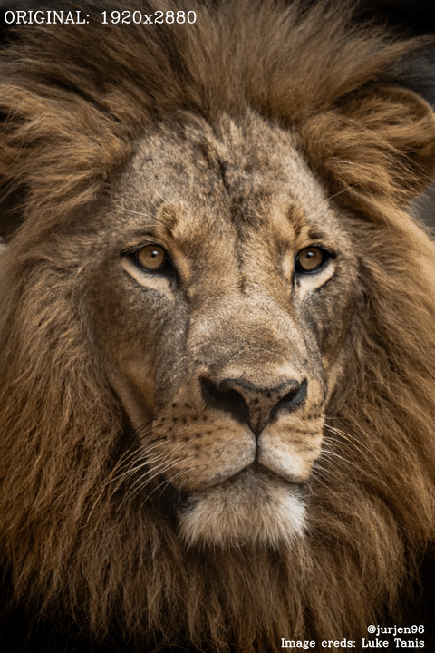

# Collage

Create a simple gray collage based on a source image and a folder 
containing the images that the collage should exist out of.



## How to use

Create an empty folder to store the images you want to use for 
the collage. 

```
mkdir img
```

To collect the images for the collage, I would recommend downloading
a web extension that allows you to quickly download a lot of images 
at the same time. I was using the extension called:
[Image Downloader](https://chrome.google.com/webstore/detail/image-downloader/cnpniohnfphhjihaiiggeabnkjhpaldj).
After downloading and installing the extension, I went to 
[Google Advanced Image Search](https://www.google.com/advanced_image_search)
and selected the Aspect Ratio to be square. This is important since 
the program currently only supports *square* images for the collage. 
Next, you should type the preferred subject for collage images in the 
inputs under 'Finding images with ...'. After filling in all details,
you should press 'Advanced Search' and use the Image Downloader 
extension to download the images you would like to be used inside 
the collage. Thereafter, you move the downloaded images to the 
`img` folder we made earlier.  

The last step before we can create the collage, is that we need 
to have a source image. This image represents the image we want to 
make a collage of. There are basically no restriction to the source 
image. It can be a square, but it can also be a rectangle. 
Personally, I would recommend using a large size image since 
it gives you more playroom to experiment with the size of the 
individual images inside the collage. 

To create the collage, simply run:
```
./main example.jpg ../img 10
```
Where:
- example.jpg: the path to the source image we use as a reference 
for the collage;
- ../img: the path to a folder containing all the images we 
want to use for our collage;
- 10: (OPTIONAL) The size of a single image (height and width) 
inside our collage.


## Credits:
Lion image: [Luke Tanis](https://unsplash.com/photos/IPRFX7CVVoU?utm_source=unsplash&utm_medium=referral&utm_content=creditShareLink) 